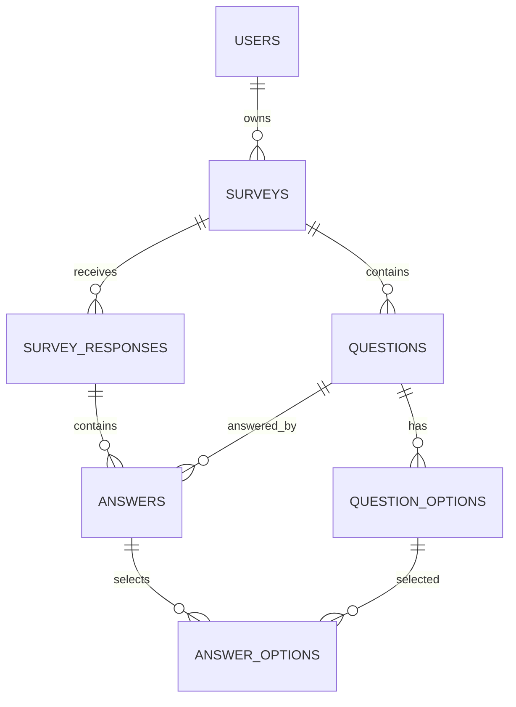

# 1. Core Tables

```text
users
surveys
questions
question_options
survey_responses
answers
answer_options
```

# 2. ERD



# 3. Key Constraints

```text
UNIQUE(users.email)
UNIQUE(surveys.slug)
UNIQUE(questions.survey_id, questions.position)
UNIQUE(question_options.question_id, question_options.position)
UNIQUE(survey_responses.survey_id, survey_responses.client_submission_id)
UNIQUE(answers.response_id, answers.question_id)
PRIMARY KEY(answer_options.answer_id, answer_options.option_id)
```

# 4. Identifier Policy

- Core internal IDs: BIGINT IDENTITY
- clientSubmissionId: UUID
- Public Survey: slug

# 5. Timestamp

DB: `TIMESTAMPTZ`

Java: `Instant`
