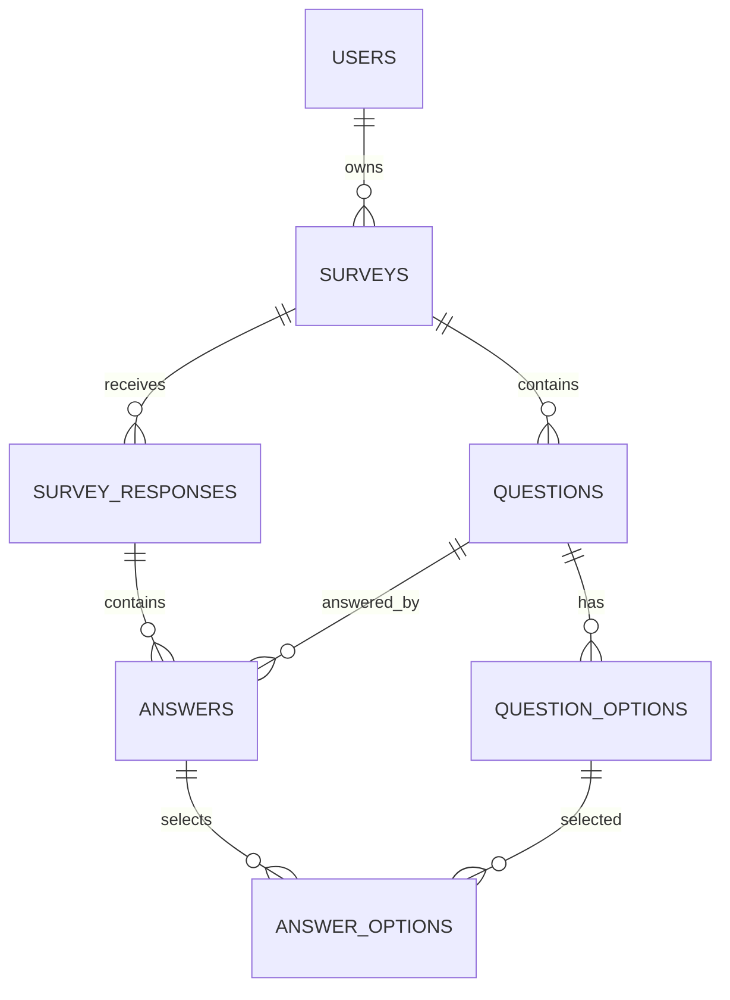

# 1. Core Tables

```text
users
surveys
questions
question_options
survey_responses
answers
answer_options
```

# 2. ERD



# 3. Key Constraints

```text
UNIQUE(users.email)
UNIQUE(surveys.slug)
UNIQUE(questions.survey_id, questions.position)
UNIQUE(question_options.question_id, question_options.position)
UNIQUE(survey_responses.survey_id, survey_responses.client_submission_id)
UNIQUE(answers.response_id, answers.question_id)
PRIMARY KEY(answer_options.answer_id, answer_options.option_id)
```

추가 CHECK boundary:

- Survey status는 `DRAFT`, `OPEN`, `CLOSED` 중 하나다.
- SCALE 설정은 integer이며 `1 <= min < max <= 10`이다.
- NUMBER min/max가 모두 있으면 `min <= max`다.
- Answer row는 text와 numeric을 동시에 저장하지 않는다.

Choice Option 최소 개수, Answer와 Question type의 정확한 representation 일치, Option ownership 같은 cross-row invariant는 application transaction에서 검증한다.

# 4. Phase 3 Migration Boundary

Shared Flyway V1~V5는 immutable하다. Phase 3-B current tree는 next `V6__create_answers_and_answer_options.sql` 하나로 `answers`와 `answer_options`만 생성한다. Existing V5 `survey_responses`는 변경하거나 다시 생성하지 않는다.

```text
answers.response_id       → survey_responses.id ON DELETE CASCADE
answers.question_id       → questions.id NO ACTION
answer_options.answer_id  → answers.id ON DELETE CASCADE
answer_options.option_id  → question_options.id NO ACTION
```

Response aggregate 내부 row는 parent aggregate deletion에 종속될 수 있지만 V1 Product Response delete path는 없다. Question/Option FK는 historical Response 의미를 보존하며 structure lock 이후 referenced structure 삭제를 허용하지 않는 기존 policy와 일치한다.

# 5. Identifier Policy

- Core internal IDs: BIGINT IDENTITY
- clientSubmissionId: UUID
- Public Survey: slug
- payloadHash: SHA-256 lowercase hex

# 6. Timestamp

DB: `TIMESTAMPTZ`

Java: `Instant`
